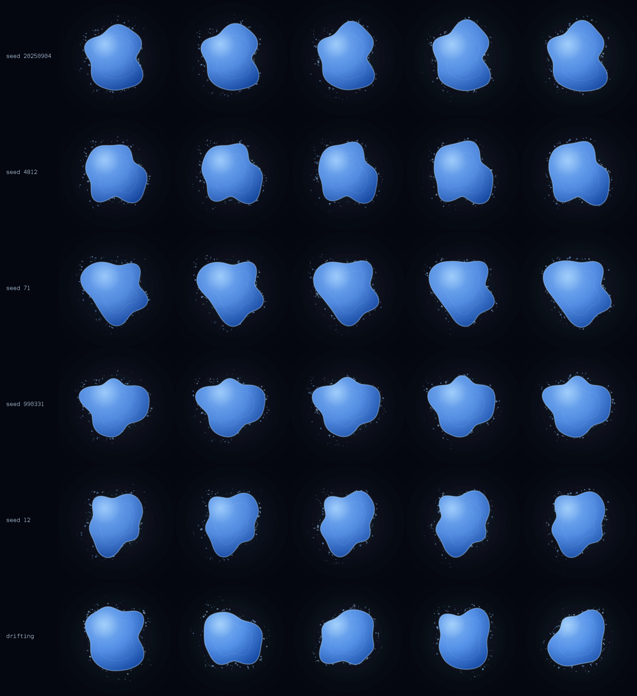
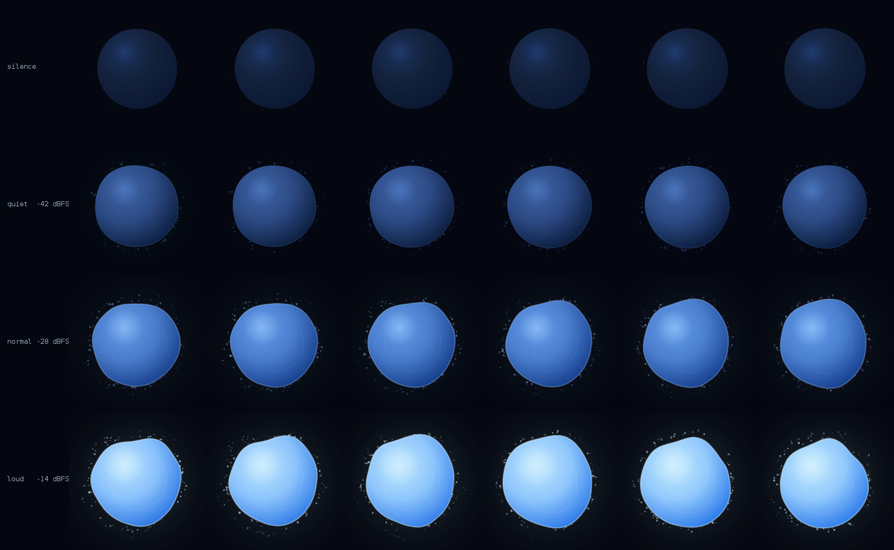
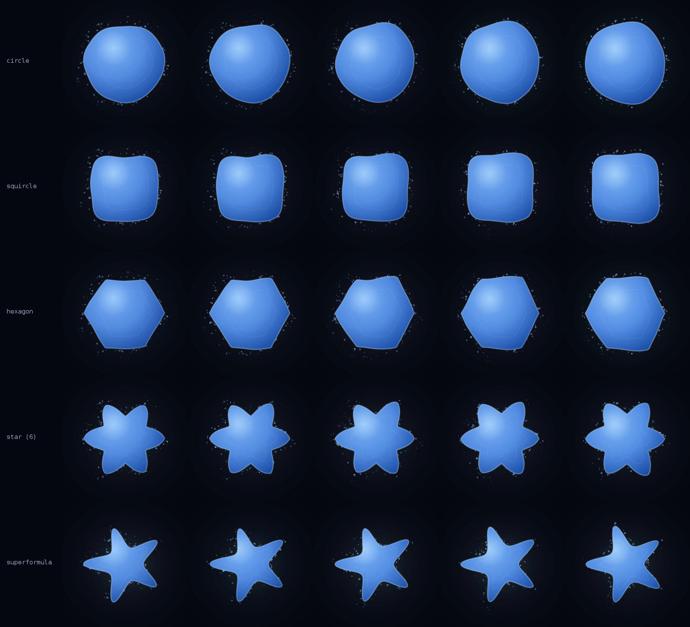
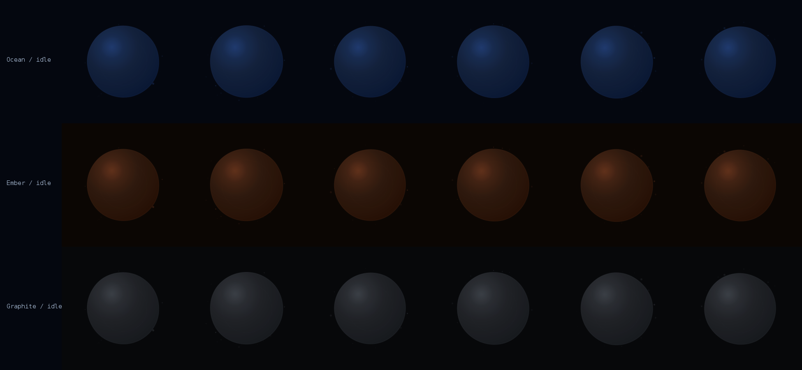

# Audio-Reactive Visualizer

A production-quality, real-time audio-reactive visualizer for **Compose Multiplatform** —
one codebase running on **Android (Jetpack Compose)**, **Windows/macOS/Linux desktop**, and
the **web** (Kotlin/Wasm), with an optional GPU shader path on all three.

The system is **shape-agnostic by construction**. The audio analysis and animation layers
produce a vocabulary of normalized visual parameters — `intensity`, `pulse`, `deformation`,
`turbulence`, `glow`, `rotation`, `displacement`, `energy` — and never learn what is being
drawn.

The default geometry is a **free-form abstract outline with no name** — not a circle, not a
polygon, not a star. Named primitives are supported and shipped, but only as evidence that the
shape is interchangeable, never as the foundation. One option is a shape with no fixed
identity at all, morphing continuously between forms while the rest of the system carries on
unaware.

---

## Table of contents

| Deliverable | Where |
|---|---|
| Recommended architecture | [docs/ARCHITECTURE.md](docs/ARCHITECTURE.md) |
| Complete implementation | this repository |
| File / class / component structure | [Project layout](#project-layout) |
| Audio-processing logic | [docs/AUDIO_PIPELINE.md](docs/AUDIO_PIPELINE.md) |
| Audio-to-animation mapping formulas | [docs/MAPPING.md](docs/MAPPING.md) |
| Smoothing / attack / release logic | [docs/AUDIO_PIPELINE.md#smoothing-primitives](docs/AUDIO_PIPELINE.md#smoothing-primitives) |
| Shape-agnostic renderer interface | [`ShapeRenderer`](visualizer-compose/src/commonMain/kotlin/com/audioviz/compose/render/ShapeRenderer.kt) |
| Example implementation (one shape) | [`OrganicBlobRenderer`](visualizer-compose/src/commonMain/kotlin/com/audioviz/compose/render/OrganicBlobRenderer.kt) |
| Replacing that shape | [docs/ADDING_A_SHAPE.md](docs/ADDING_A_SHAPE.md) |
| Performance considerations | [docs/PERFORMANCE.md](docs/PERFORMANCE.md) |
| Configuration parameters | [docs/TUNING.md](docs/TUNING.md) |
| Testing with speech | [docs/TESTING.md](docs/TESTING.md) |
| What it actually looks like | [rendered contact sheets](#what-it-looks-like) |

---

## What it looks like

These are rendered from the real pipeline — synthetic speech through the real analyzer,
the real animation controller and the real geometry — by `./gradlew :preview-tool:renderPreview`,
headlessly, with no display and no device.

**Free-form geometry.** Five generated seeds, plus one row that never settles on a form at
all. None of these is a circle, a polygon or a star; none of them has a name. Every row is the
same analyzer, the same controller, the same motion field.



**Response to input level.** One row per level, six frames across about two seconds. Reading
down a column shows how the same instant differs with loudness; reading across shows the motion.



Note what changes and what does not: colour travels from deep navy to ice blue, glow and
deformation grow steadily, particles appear — and the object is barely larger at −14 dBFS than
at −42. Scale moves 7% across the whole range while deformation moves 480%.

**Named primitives, for comparison.** The same pipeline again, this time through shapes that
do have names. Included to prove interchangeability, not because the system needs them.



**Idle, across the three bundled palettes.** Twelve seconds of complete silence, sampled every
two seconds. The visual parameters are constant here — all of this motion comes from the shared
noise field and the breath oscillators.



---

## Why Compose Multiplatform

The brief asked for Jetpack Compose but for use on Windows and web. Compose Multiplatform is
the same Compose — same `@Composable`, same `Canvas`, same `DrawScope`, same
`withFrameNanos` — compiled for Android, JVM desktop and Kotlin/Wasm. Nothing in this
project uses a Compose API that Jetpack Compose does not have, so an Android-only consumer
can take `visualizer-core` and `visualizer-compose` unchanged.

Only three things are genuinely platform-specific, and each is one `expect`/`actual` pair:

| Concern | Android | Desktop | Web |
|---|---|---|---|
| Microphone capture | `AudioRecord` | `TargetDataLine` | `getUserMedia` + `AnalyserNode` |
| Runtime shaders | `RuntimeShader` (AGSL, API 33+) | `RuntimeEffect` (SkSL) | `RuntimeEffect` (SkSL) |
| Permission | runtime grant | none | browser prompt |

---

## Quick start

```kotlin
@Composable
fun ListeningIndicator() {
    val source = remember { createMicrophoneSource() }        // platform microphone
    val state = rememberVisualizerState(source)               // analyzer + controller
    AudioVisualizer(
        renderer = remember { OrganicBlobRenderer() },        // <- the only line tied to a shape
        state = state,
        modifier = Modifier.fillMaxSize(),
    )
}
```

`OrganicBlobRenderer()` with no arguments draws a free-form abstract outline. Change the
geometry by changing that one line:

```kotlin
// a different abstract form — every seed is its own creature
OrganicBlobRenderer(BlobRendererConfig(shape = RadialShapes.organic(seed = 4812)))
// no fixed identity at all: morphs between forms forever
OrganicBlobRenderer(BlobRendererConfig(shape = RadialShapes.driftingOrganic()))
// or a named primitive, if you want one
OrganicBlobRenderer(BlobRendererConfig(shape = RadialShapes.polygon(6)))
// a traced outline from a designer
OrganicBlobRenderer(BlobRendererConfig(shape = RadialShapes.sampled(myRadii)))
// not radial at all
WaveRibbonRenderer()
// GPU aura + particles + body, as one coherent object
CompositeRenderer(ShaderGlowRenderer(), ParticleAuraRenderer(), OrganicBlobRenderer())
```

No other file changes. See [docs/ADDING_A_SHAPE.md](docs/ADDING_A_SHAPE.md).

---

## Running it

```bash
./gradlew :demo-app:run                       # desktop (Windows / macOS / Linux)
./gradlew :demo-app:wasmJsBrowserDevelopmentRun   # web, opens a browser
./gradlew :demo-app:installDebug -Pviz.android=true   # Android device
./gradlew checkAll                            # compile everything + run the tests
./gradlew :preview-tool:renderPreview         # PNG contact sheets, no display needed
```

The demo exposes every tuning knob live — renderer, palette, character preset, sensitivity,
gate threshold, and a microphone/synthetic-source switch — so the manual test procedure in
[docs/TESTING.md](docs/TESTING.md) can be run against any combination without a rebuild.

### The Android target is opt-in

The Android target needs the Android SDK *and* access to Google's Maven repository. Desktop
and web need neither, so the target is enabled only when an SDK is detected:

```properties
# gradle.properties
viz.android=auto     # auto (default) | true | false
```

`auto` enables it when `local.properties` has `sdk.dir` or `ANDROID_HOME` is set. Add
`-Pviz.googleRepo=false` on a network that can only reach Maven Central; in that
configuration only the Wasm target resolves, and `./gradlew checkPortable` is the
corresponding verification task.

---

## Project layout

Four modules, each depending only on the one below it.

```
visualizer-core          pure Kotlin — no Compose, no platform APIs, fully unit-tested
├── dsp/                 signal processing
│   ├── Smoothing.kt         OnePole, AttackRelease, SlewLimiter, Deadband, Spring
│   ├── RealFft.kt           allocation-free real-input FFT
│   ├── LevelDetector.kt     DC blocker, RMS/peak, adaptive normalizer, noise gate
│   └── SpectrumAnalyzer.kt  log-spaced bands, spectral centroid, onset detection
├── analysis/
│   ├── AnalyzerConfig.kt    every audio tunable, with presets
│   ├── AudioAnalyzer.kt     re-framing + the whole chain; publishes AudioFeatures
│   └── AudioFeatures.kt     immutable snapshot handed to the render thread
├── anim/
│   ├── Noise.kt             Perlin 3D + MotionField (the shared coherent field)
│   ├── VisualParams.kt      THE shape-agnostic contract
│   ├── AnimationConfig.kt   every mapping constant, with presets
│   └── AnimationController.kt   features -> params
├── geometry/
│   ├── RadialShape.kt       free-form generator, morphing outlines, and the
│   │                        named primitives (circle, squircle, polygon, star,
│   │                        superformula, sampled)
│   ├── PolarProfile.kt      shape + params -> deformed outline
│   └── ParticleField.kt     pooled, allocation-free particle simulation
├── color/
│   ├── Oklab.kt             perceptual colour space
│   └── Palette.kt           LUT-baked gradients + bundled treatments
└── capture/
    ├── AudioSource.kt       the interface the platform layer implements
    └── SyntheticAudioSource.kt   speech-like generator for demos and tests

visualizer-audio         platform microphone capture (expect/actual)
├── commonMain           createMicrophoneSource()
├── androidMain          AudioRecord, voice processing explicitly disabled
├── jvmMain              TargetDataLine on a dedicated thread
└── wasmJsMain           getUserMedia + AnalyserNode, polled per frame

visualizer-compose       rendering — knows nothing about microphones
├── AudioVisualizer.kt   the host composable and its frame loop
├── VisualizerState.kt   analyzer + controller + status, as Compose state
├── render/
│   ├── ShapeRenderer.kt         the renderer interface + CompositeRenderer
│   ├── VisualFrame / RenderPalette / PathBuilders
│   ├── OrganicBlobRenderer.kt   the reference example
│   ├── WaveRibbonRenderer.kt    a deliberately non-radial renderer
│   └── ParticleAuraRenderer.kt  particles that follow any outline
└── shader/
    ├── RuntimeShaderSupport.kt  expect; skiko + AGSL actuals
    └── ShaderGlowRenderer.kt    GPU aura, with a Canvas fallback

demo-app                 sample application for all three platforms

preview-tool             headless Java2D renderer for the contact sheets above.
                         Depends only on visualizer-core and a JDK -- no Compose,
                         no Android SDK -- so the geometry can be inspected in CI
                         and in code review.
```

**~9,600 lines of Kotlin**, of which ~1,800 are tests.

---

## How it works, in one page

```
 microphone ──► AudioSource ──► AudioAnalyzer ──► AudioFeatures ──► AnimationController ──► VisualParams ──► ShapeRenderer
               (platform)      (audio thread)     (immutable)        (render thread)        (reused)         (draws)
                                                       │
                                              the only thing that
                                              crosses threads
```

1. **Capture** delivers mono float PCM. Push-based on Android and desktop (a dedicated
   capture thread); pull-based in the browser, where the host calls `pump()` once a frame.
2. **Analysis** re-frames the input to a fixed 1024-sample window with a 512 hop, then:
   DC-blocks it, measures RMS in dBFS, tracks an adaptive noise floor and loud reference,
   gates it with hysteresis and hold, runs three envelope followers at different time
   scales, and (optionally) an FFT for six log-spaced bands, spectral brightness and
   onset detection. It publishes an immutable `AudioFeatures` snapshot.
3. **The controller** runs on the *render* thread at display rate, independently of the
   audio rate. It converts features into `VisualParams` using a different smoother and a
   different response curve for each parameter — springs where mass is wanted, attack/release
   envelopes where snap is wanted, slew limiters where flashing must be impossible.
4. **The renderer** reads `VisualParams` and draws. It has no access to anything upstream.

The full formulas are in [docs/MAPPING.md](docs/MAPPING.md).

### Measured cost

`./gradlew :preview-tool:benchmarkCore`, desktop JDK 21, median of seven trials:

| Stage | Per call | Share of one core |
|---|---|---|
| Analyzer — 1024/512, FFT, 6 bands | 13.4 µs @ 93.8/s | 0.125 % |
| Animation controller | 0.69 µs @ 60/s | 0.004 % |
| Polar profile, 128 samples | 25.8 µs @ 60/s | 0.155 % |
| Particle field, 160 particles | 18.2 µs @ 60/s | 0.109 % |

Audio and render together: **0.39 % of one core**. Note the shape of it — the *geometry*
costs roughly twice what the DSP does, which is the opposite of where the instinct to optimise
points. Full numbers, and the three things the benchmark corrected, in
[docs/PERFORMANCE.md](docs/PERFORMANCE.md).

### The three ideas that make it feel premium

**Everything is layered.** Every visible parameter is a sum of contributions from several
audio signals with different time constants, and each parameter uses a *different* smoother.
Glow arrives a fraction before the shape finishes deforming; rotation keeps its momentum
after the pulse dies. Because the parameters lag each other, a set of numbers reads as one
living object rather than as several synchronised animations.

**Loud does not mean big.** Scale contributes at most ~11% and is the weakest response in
the system; a rising transient injects *velocity* into the scale spring rather than raising
its target, so an emphasised syllable reads as a physical recoil. The reaction is carried by
deformation, turbulence, glow, interior detail and — most of all — by the animation clock
itself running faster when the audio is lively.

**Nothing clips.** Contributions are chosen to sum slightly above 1 at full input, and a
soft knee bends that sum asymptotically toward 1. A clipped parameter is a dead parameter:
it stops responding exactly when the user is being most emphatic.

---

## Verification

```bash
./gradlew checkPortable          # 52 tests + every Maven-Central-only target
./gradlew checkAll               # + desktop Compose, the Skia pixel tests, and Android
./gradlew :preview-tool:benchmarkCore   # measured throughput on this machine
```

`checkPortable` is the subset that resolves from Maven Central alone; `checkAll`
additionally needs Google's Maven (for the `androidx` artifacts Compose's JVM and Android
variants depend on) and, for the Android target, an SDK. Both run on every push — see
[`.github/workflows/ci.yml`](.github/workflows/ci.yml), which also uploads the contact sheets
and the debug APK as build artifacts.

The test suite is not incidental — it is how the tuning above is held in place:

- `RealFftTest` checks the fast real-input transform against a naive DFT, bin for bin.
- `SmoothingTest` proves the followers behave identically at 60 fps and 240 fps, that the
  spring survives 8 fps without diverging, and that the dead-band converts jitter into a
  standstill.
- `LevelNormalizerTest` shows a microphone 20 dB hotter than another converges on the same
  normalized level, and that the gate neither chatters at the threshold nor drops out
  between words.
- `VisualResponseTest` drives synthetic speech at −60, −42, −28, −14 and −3 dBFS through the
  whole chain and asserts monotonic response, that silence is calm but still moving, that
  glow and colour cannot step faster than their rate limits, that behaviour is identical at
  30/60/120 fps, and — explicitly — that deformation out-responds scale by more than 5:1.
- `GeometryTest` checks that every shape — including free-form ones at arbitrary seeds — is
  periodic, positive and **peaks at exactly 1** so shapes are interchangeable, that a star
  stays star-shaped at every softness, that a morphing outline keeps travelling without
  jumping and is not silently frozen by the profile's cache, that the outline has no seam at
  the wrap point, that it keeps moving in silence, and that particles respect their capacity
  and get recycled.
- `ShaderCompilationTest` compiles the bundled shader with the real Skia SkSL compiler, so a
  typo in the shader string is a build failure rather than a silently missing layer.
- `RendererPixelTest` rasterises every bundled renderer into a Skia-backed `ImageBitmap` and
  asserts on the pixels: that each one draws something and floods nothing, that louder audio
  yields a measurably brighter frame, that three different shapes produce three different
  images, that the palette changes the image, and that no pixel is transparent or out of
  gamut. It deliberately avoids Compose's test clock — the frame loop is an infinite
  `withFrameNanos` coroutine, so anything that waits for idle would hang.

---

## License

Provided as-is for integration into your application.
